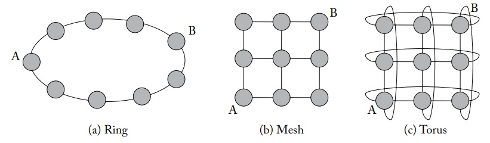
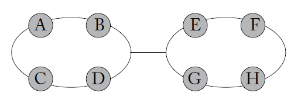
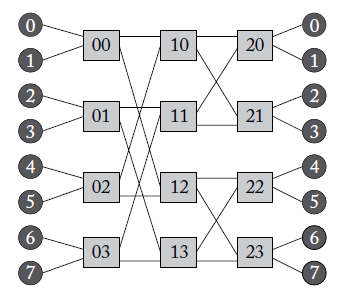
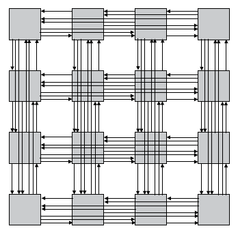
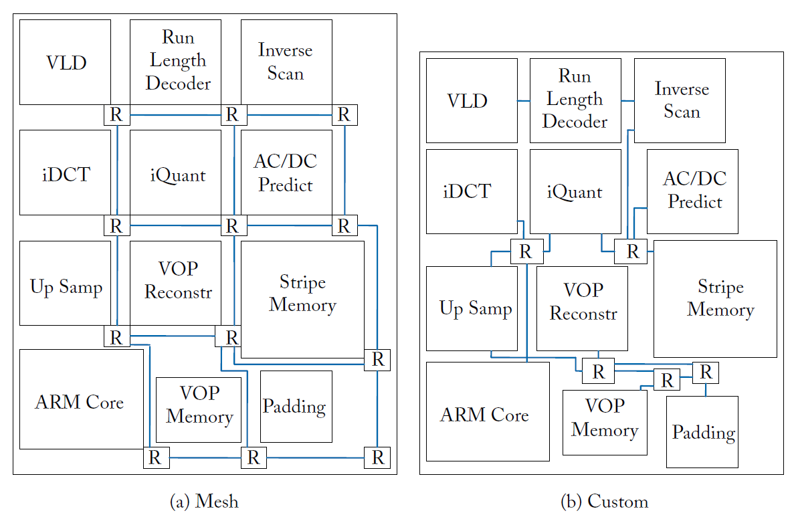
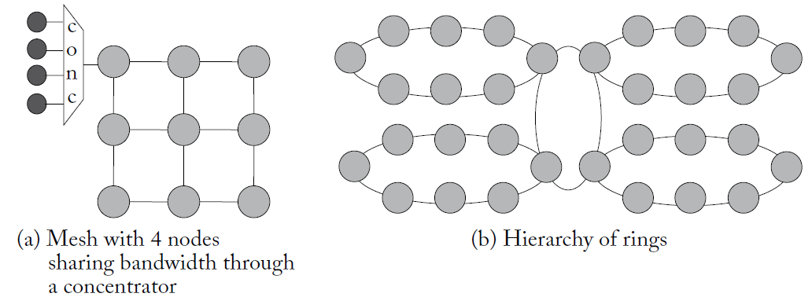

拓扑结构是NoC最先确认的部分，为了衡量不同的拓扑结构的质量，所以定义了一些指标，以下面三种拓扑结构为参考。

* **通道-channel**： 路由之间的连接，也就是链路，即图中的线
* **节点-node**：路由器，即图中的点
* **度-degree**：每个节点的链路数，即图中一个点连接的线数量。Ring为2，Torus为4，Mesh每个节点不一样。更高的度代表了更多的路由器端口，面积功耗也就越大
* **网络直径-diameter** ：网络中两个节点之间最短距离集合的最大值，Ring是4，Mesh是4，Torus是2。没有竞争时，直径可视为网络最大延迟
* **对分带宽-bisection bandwidth**：将网络二等分切开后，斩断的链路数量，Ring为2，Mesh为3，Torus为6。该指标定义了网络最差情况下的性能，越大表示性能越好

上面的指标与网络流量无关，下面的指标与流量有关。网络流量指某段时间内，网络中 packet/message 的注入与传输情况，这受到实际通信模式和拓扑结构的影响。

* **跳数-hop count**：消息从源节点到目标节点经过的hop/链路数。最大跳数由网络直径决定，平均跳数也很重要。其中Ring的A到B，hop count为4. 假设节点数相同，流量均匀，节点转发概率均匀随机，考虑平均跳数有`Ring > Mesh > Torus`

* **最大通道负载-maximum channel load**： `最大注入带宽-Maximum injection bandwidth = 1 / 最大通道负载`. 在特定的流量模式下，瓶颈通道能够承受的流量就是最大通道负载。比如下图中，瓶颈通道为双向通道，一个周期内每个节点都有`1/8`的概率像其他节点发送`flip`，那么所有节点的流量有1/2的概率经过瓶颈通道，所以最大注入带宽是1/2，最大通道负载是2.

  

* **通道多样性-path diversity**：能够提供多个最短路径的网络具有更好的通道多样性，这对路由算法很重要。Ring就没有通道多样性。

## 直连拓扑-direct topology

指的是一个终端节点搭配一个路由节点的网络，即路由节点不仅收发其他路由节点的信息，还收发本身终端节点的信息。拓扑结构使用`k-ary n-cube`记法，表示n维，每个维度k个节点。比如4x4的2D mesh表示为k=4，n=2。

| 指标                        | 1-D Ring                   | n-D Mesh                                 | n-D Torus                                 |
| --------------------------- | -------------------------- | ---------------------------------------- | ----------------------------------------- |
| 节点总数                    | $N = k$                    | $N = k^n$                                | $N = k^n$                                 |
| Degree                      | $2$                        | $2n$（边缘节点更少）                     | $2n$                                      |
| Diameter                    | $\frac{k}{2} $             | $n(k-1)$                                 | $n\left\lfloor \frac{k}{2} \right\rfloor$ |
| Average Hop Count（k even） | $\frac{k}{4}$              | $\frac{nk}{3}$                           | $\frac{nk}{4}$                            |
| Average Hop Count（k odd）  | $\frac{k}{4}-\frac{1}{4k}$ | $n\left(\frac{k}{3}-\frac{1}{3k}\right)$ | $n\left(\frac{k}{4}-\frac{1}{4k}\right)$  |
| Bisection Bandwidth         | 2                          | $2k^{n-1}$                               | $4k^{n-1}$                                |
| Maximum Channel Load        | 高                         | 低                                       | 更低                                      |
| 物理可扩展性                | 差                         | 好                                       | 理论好，物理受限                          |
| 拥塞分布特性                | 易形成热点                 | 中心区域拥塞                             | 更均匀                                    |
| 路由算法实现复杂度          | 很低                       | 简单（DOR / XY）                         | 稍复杂                                    |
| 工业适用性                  | 小规模                     | 主流 NoC                                 | HPC / 研究更多                            |

## 非直连拓扑-indirect topology

指存在只用于传递信息的交换节点的拓扑网络，比如**crossbar**，**butterfly**，**clos network**和**fattree**。起结构如下图：butterfly表示方式是`k-ary n-fly`，包含$k^n$个源/目标节点，共用n级交换节点，每级有$k^{n-1}$个交换节点。表格中butterfly的degree, diameter, hop, 最大通道复杂都是只讨论交换节点之间.

*图：2-ary 3-fly的butterfly*

**butterfly**结构存在一个变种Flattened Butterfly, 通过将同一行的中间交换节点压缩成一个节点,实现非直连拓扑转换为直连拓扑.

*图：4-ary 4-fly的Flattened  butterfly*

**Clos network**是三级网络，使用(m,n,r)三元表达方式。m表示中间路由节点数量，r表示输入/输出节点数量，n表示每个输入/输出节点对源/目标端口数。该网络的缺点在难以利用源目标对的局部性。

*图：(m = 5, n = 3, r = 4).*

其变种网络是折叠clos， 将标准clos沿着中间节点进行折叠，实现输入输出节点的共享。

*图：5阶段折叠clos， 由(2,2,4)clos折叠得到， 中间阶段被(2,2,2)clos替换*

**fat tree**是二叉树结构，能够很好地利用通信的局部性，数据将自底向上传递后再自顶向下传递。

| 指标                        | Butterfly        | Clos Network                                | Fat Tree                           |
| --------------------------- | ---------------- | ------------------------------------------- | ---------------------------------- |
| 节点总数                    | $N=k^n$          | $N=r\cdot n$                                | $N$                                |
| 交换机数量                  | $n k^{n-1}$      | $2r+m$                                      | 约 $O(N)$                          |
| Degree                      | $2k$             | first/last stage: $n+m$；middle stage: $2r$ | 逻辑 degree 通常为 4；上层链路更宽 |
| Diameter                    | $n-1=\log_k N-1$ | 4 （三级 Clos）                             |                                    |
| Average Hop Count（k even） | $n-1$            | 4 （三级 Clos）                             |                                    |
| Average Hop Count（k odd）  | $n-1$            | 4 （三级 Clos）                             |                                    |
| 路径多样性                  | 低               | 较高                                        |                                    |
| 是否利用局部性              | 否               | 否                                          | 是                                 |

## 不规则拓扑-irregular topology

并非所有NOC都使用标准拓扑，对于可以预先确定通信模式的异构NOC，可以对标准拓扑结构进行自定义。例如某些节点之间不需要进行通信，某些路由需要更多的端口等等，以减少芯片面积功耗。

自定义拓扑的两种方法是split(拆分)和merge(合并)。举例如下：

* split: 设计一个crossbar网络，然后将其不断拆分为多个小的crossbar网络组合
* merge: 设计一个mesh网络，通过合并路由节点来降低面积功耗

*图：一个3x4的标准mesh进行自定义得到的新拓扑结构*

## 分层拓扑-hierarchical topology

多个节点通过一种拓扑结构形成一个集群，多个集群之间通过另一种拓扑结构进行连接。下图展示了两种分层拓扑，图a为多核心共享路由节点，这样一个3x3的mesh网络就携带了36个核心，缺点是复杂度高以及突发通信时注入端口带宽成为瓶颈；图b是32个核心组成4个ring，4个ring通过一个中心ring连接，挑战是中心环的带宽仲裁问题。

## 实现

在物理实现中， 拓扑结构的**路由器**和**链路**需要重点考虑。拓扑网络的degree越高，物理代价也就越高，所以虽然ring的性能较差，但他的degree只有2，相比mesh更低。拓扑网络不是理论上平均hop越低越好，要考虑二维空间，比如Torus的边缘长链路需要使用folded form的技术来均匀线长，而不是设计一条很长的连线，是的torus的布线资源是等规模mesh的两倍，使其每跳延迟和能耗更高。

* **Node degree** 可以近似衡量路由器复杂度，但不能直接衡量链路复杂度。链路开销更依赖总导线数、链路宽度和物理距离，而不是端口数量本身。

* **Hop count** 常用来近似估计延迟和能耗，但它并不总是可靠。实际延迟还取决于路由器流水线深度、链路传输延迟和时钟频率。因此，hop count 更低的拓扑不一定实际更快。

* 不同拓扑通常在 **低 node degree / 高 hop count** 和 **高 node degree / 低 hop count** 之间权衡。例如 ring 简单但跳数高，flattened butterfly 跳数低但路由器复杂，mesh/torus 介于两者之间。

* **Maximum channel load** 用来估计网络拥塞和饱和吞吐率。最大通道负载越高，瓶颈链路越拥塞，网络可实现吞吐率越低。它还可以近似估计峰值功耗，因为网络接近饱和时动态功耗最高。

* **isection bandwidth** 常用于衡量网络带宽，尤其在 uniform random traffic 下，对分链路的负载通常决定峰值吞吐能力。但实际吞吐率还会受到路由和流控协议负载均衡能力的影响。

